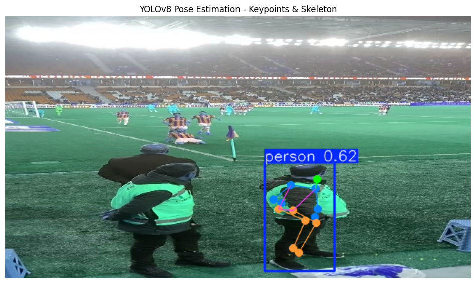
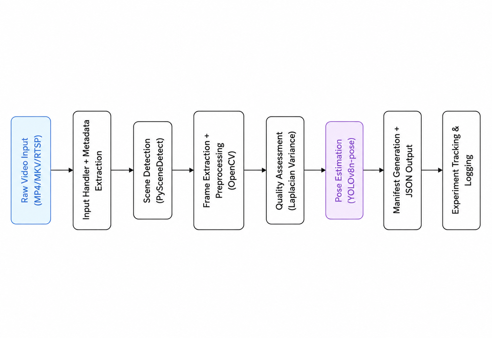
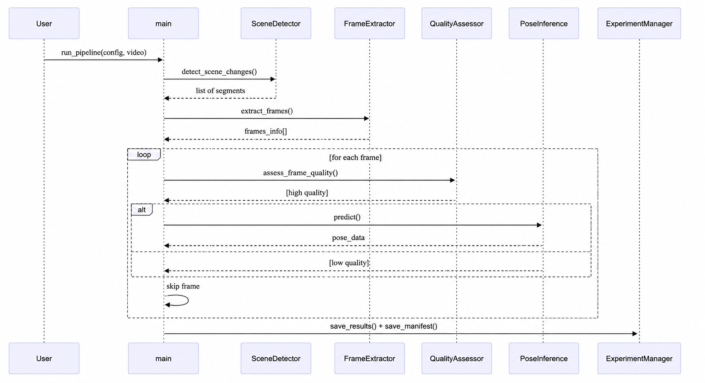

# Human Pose Estimation Video Pipeline

**PhD Application Technical Assessment**  
*Video Ingestion & Preprocessing Pipeline for Sports Computer Vision*

A robust, modular, and production-ready video processing pipeline that handles raw sports video input and produces analysis-ready frames with human pose estimation metadata.

---

## 📋 Overview

This project implements a complete **video ingestion and preprocessing pipeline** as required for the PhD technical assessment. It extracts structured, high-quality frames from team sports videos and enriches them with scene segmentation, quality scores, and YOLOv8 pose estimation — ready for downstream computer vision tasks.

A sample Output : 


---

## 📁 Project Structure

```bash
Human_Pose_Estimation/
├── configs/
│   └── config.yaml                    # Main pipeline configuration
├── src/
│   ├── core/
│   │   ├── __init__.py
│   │   ├── pipeline.py
│   │   ├── inference.py
│   │   ├── evaluator.py
│   │   └── experiment.py
│   ├── utils/
│   │   ├── __init__.py
│   │   ├── video_utils.py
│   │   └── ...
│   └── samples/
│       └── sample_video.mp4           # Sample input video
├── tests/                             # Unit tests
├── outputs/                           # Generated outputs (ignored)
│   ├── demo_frames/
│   └── video_YYYYMMDD_HHMMSS/         # Timestamped processing runs
├── experiments/                       # Experiment tracking (ignored)
├── logs/                              # Log files (ignored)
├── main.py                            # Main entry point
├── demo_notebook.ipynb                # End-to-end demonstration
├── requirements.txt
├── .gitignore
└── README.md
```
# Key Features
- Multi-format video support (MP4, MKV, etc.)
- Scene change detection using scenedetect
- Configurable frame extraction + preprocessing
- Frame quality assessment (Laplacian variance)
- YOLOv8 Pose Estimation integration
- Structured JSON metadata manifest
- Experiment tracking and logging
- Jupyter Notebook demo

# System Architecture
- Data Flow 
  

- Sequence Diagram
  

# Installation
```bash 
#1. Clone the project
git clone https://github.com/Vishalkumar158/PHD_ASSIGNEMNT.git
cd Human_Pose_Estimation

# 2. Install dependencies on Windows
python -m venv pose
pose\Scripts\activate
pip install -r requirements.txt
```

# Usage
- Run the Full Pipeline
```bash
# Standard run
python main.py --config configs/config.yaml

# With custom input video
python main.py --config configs/config.yaml --input samples/sample_video.mp4
```

# Interactive Demo (Recommended)
demo notebook 

# Output Structure
After running the pipeline you will see:

- `outputs/video_YYYYMMDD_HHMMSS/`
- `frames/ — Preprocessed image frames`
- `metadata.json — Rich per-frame metadata + pose data`

- `experiments/exp_YYYYMMDD_HHMMSS/ — Config, metrics & results`
- `logs/pipeline.log`

# Jupyter Notebook
The  provides a complete visual walkthrough of the entire pipeline — ideal for demonstration during your PhD assessment.

#  Troubleshooting

- Video path issues → Use forward slashes / or absolute paths
- Missing ffmpeg → Install system-wide ffmpeg
- Slow performance → Increase frame_interval or use GPU version of PyTorch
- Low quality frames filtered → Lower quality_threshold in config


#  Assessment Alignment
This implementation fully addresses all requirements in the technical assessment:

- ✅ Input handling (multiple formats + metadata extraction)
- ✅ Pre-processing (frame extraction, transformations, scene detection)
- ✅ Quality assessment
- ✅ Functional computer vision integration (YOLOv8 Pose)
- ✅ Structured output manifest
- ✅ Clean, modular, documented codebase

```bash
Prepared for PhD Application
June 2026
```

# References 
- [PySceneDetect](https://github.com/breakthrough/pyscenedetect)
- [Learning to Segment a Video to Clips Based on Scene and Camera Motion](http://chenlab.ece.cornell.edu/people/adarsh/publications/eccv2012_video2clips.pdf)
